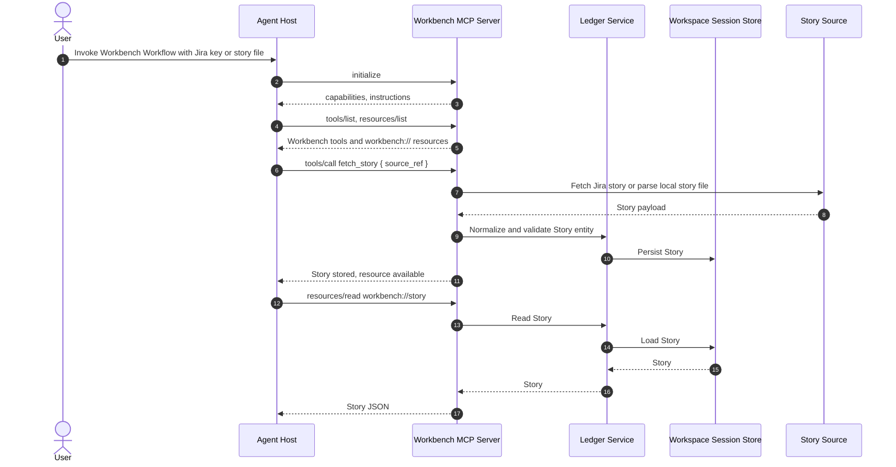
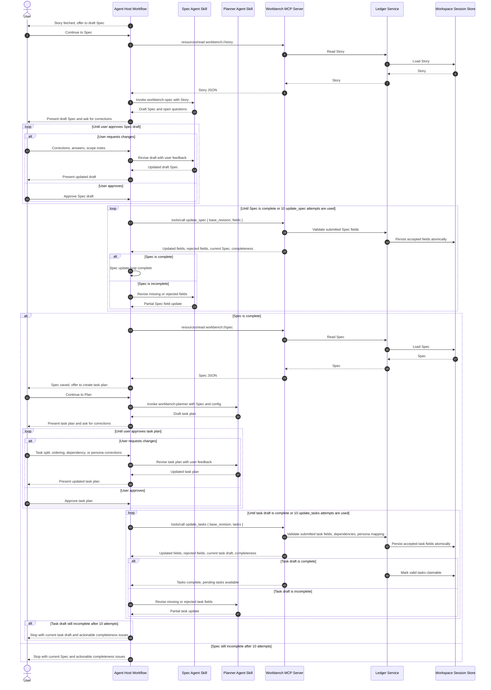
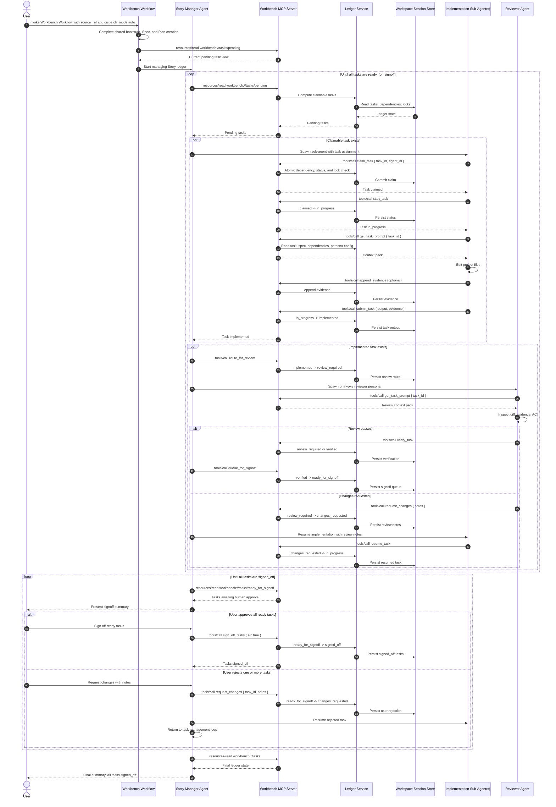
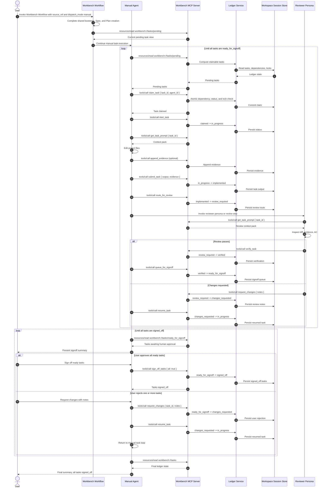
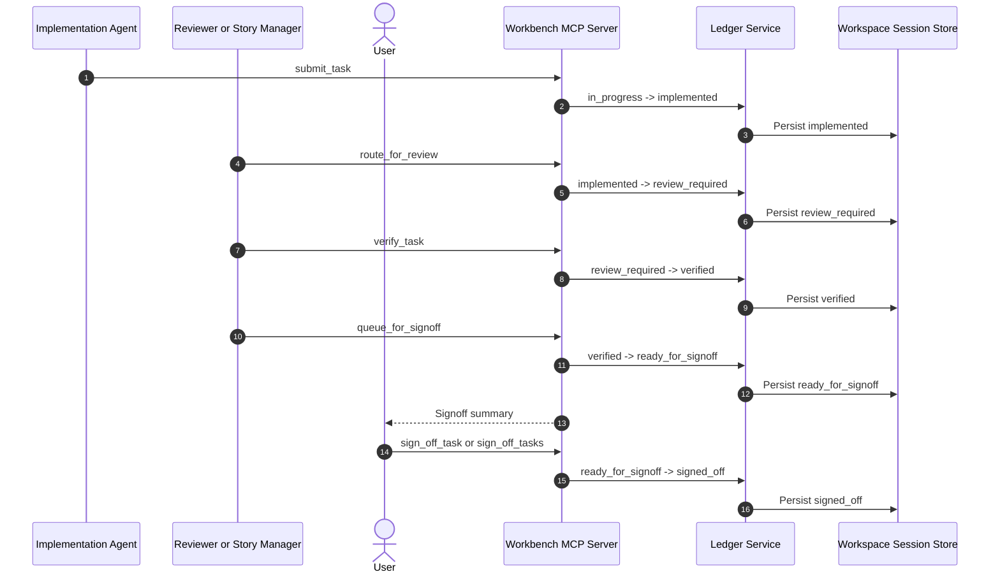

# AI Agent Workbench — Sequence Diagrams

These diagrams document the end-to-end Workbench session from a user's Jira ticket reference or local story file to all tasks reaching `signed_off`.

They use Mermaid `sequenceDiagram` blocks, which render in GitHub Markdown and common VS Code Markdown preview extensions.

The diagrams intentionally show the pipeline ingestion tools (`fetch_story`, `update_spec`, `update_tasks`) because the Story, Spec, and Task write path must be explicit. Exact field shapes, result schema, revision handling, and circuit breaker semantics remain deferred implementation details.

---

## Actors And Planes

| Name | Plane | Definition |
|------|-------|------------|
| User | Human | Person who provides the Jira ticket reference or local story file, reviews summaries, approves signoff, or requests changes. |
| Agent Host | Agent runtime | Claude Code, Codex, Windsurf, Cursor, or another environment that runs the Workbench Workflow and can call MCP tools/resources. |
| Workbench Workflow | Agent runtime | The user-invoked workflow that coordinates story fetch requests, spec, plan, dispatch, review, and summary. It runs inside the agent host, not inside the CLI. |
| Spec Agent Skill | Agent runtime | `workbench-spec`; expands a Story into a structured Spec and flags product ambiguity as `OpenQuestion[]`. |
| Planner Agent Skill | Agent runtime | `workbench-planner`; converts a valid Spec into typed tasks, dependencies, priorities, and persona assignments. |
| Story Manager Agent | Agent runtime | Auto-mode coordination persona for one Jira Story. Reads pending tasks, understands personas and skills, assigns work, tracks blockers, routes review, recovers tasks, and presents signoff. |
| Implementation Sub-Agent | Agent runtime | Agent assigned to one task. It claims the task, edits project files, records evidence, and submits output. |
| Reviewer Agent | Agent runtime | Agent or review step that checks implemented work against acceptance criteria and either verifies it or requests changes. |
| Story Source | External system | Source of the raw story. First-class user entrypoints are Jira Cloud and local Markdown/YAML/JSON story files. The mock Jira adapter is for test/local development. |
| Workbench MCP Server | Coordination boundary | Stdio MCP server launched by the agent host. Exposes `workbench://` resources and mutation tools. It performs deterministic Jira fetches and never calls a model. |
| Ledger Service | Coordination boundary | Deterministic domain layer behind MCP. Validates payloads and state transitions, computes claimable task views, tracks retries/locks, and applies atomic store updates. |
| Workspace Session Store | Local state | Workspace-scoped backing store under `.workbench/` or equivalent. Holds Story, Spec, tasks, locks, evidence, and revisions with atomic updates. |
| Project Files | Workspace files | The actual repository or working directory files modified by implementation agents. These are not the ledger. |

Plane boundaries:

- Human plane: User decisions and approval.
- Agent runtime plane: Workflows, Skills, sub-agents, and reviewers. This is where model reasoning happens.
- Coordination plane: MCP tools/resources, Ledger Service, and workspace session store. This validates and persists state but does not perform AI judgment.
- External/system plane: Story source and project files.

---

## Shared Bootstrap

This setup is common to both `auto` and `manual` dispatch modes.

Notes:

- The user supplies a Jira reference or a local story file, not a full spec.
- The Workflow runs inside the agent host. The CLI/MCP server does not call a model.
- MCP owns deterministic source loading. For Jira it fetches through the configured adapter. For local stories it parses Markdown, YAML, or JSON into the same Story entity. In test/local development, the Jira adapter can be replaced with a mock.
- Local story files should provide at least `title` and `description`. The filename, such as `JIRA-123.md`, can supply the Story `id` when the file does not include one.
- Jira config and credential precedence are tracked separately in `DesignGaps.md` Gap 9.
- Story persistence should happen through an MCP tool, not by an agent directly editing `.workbench/` files.

---

## Spec And Plan Creation

This path is also common to both dispatch modes and is the core of Gap 4.

Notes:

- The user can start the Spec step explicitly after Story fetch, or accept a Workflow continuation offer.
- The Spec draft should loop with the user before planning. User feedback is product clarification, not schema repair.
- `update_spec` is the validation boundary. Agents can submit partial field updates; MCP stores accepted fields, rejects invalid fields, returns the current Spec, and reports completeness.
- Spec update loops are capped at 10 attempts. After that, the Workflow stops and shows the current Spec plus missing/invalid fields.
- Schema failures should produce repairable structured errors. They should not be silently converted into `OpenQuestion[]`.
- `OpenQuestion[]` remains for product or requirements ambiguity discovered during spec generation.
- The current domain model does not have a persisted `Plan` entity. "Plan" means a transient draft task list produced by the Planner Agent.
- The task plan should loop with the user before `update_tasks`, just like the Spec draft loops before `update_spec`.
- `update_tasks` follows the same partial-update pattern as `update_spec`: accepted/rejected fields, current task draft, completeness, and a 10-attempt cap.
- Tasks become claimable only after the task draft is complete and valid.

---

## Auto Dispatch Mode

In auto mode, the Story Manager Agent runs inside an agent host that can spawn sub-agents natively.

Notes:

- The Workbench Workflow performs bootstrap, Spec, and task creation. The Story Manager takes over once tasks exist.
- The Story Manager spawns agents through the host's native mechanism. MCP does not spawn agents.
- The loop is shown as a polling/management cycle because new tasks can become claimable after dependencies are verified.
- Signoff rejection returns tasks to `changes_requested` and control returns to the task management loop above.
- Every ledger mutation is an MCP tool call with atomic store updates.
- Human approval is represented by `signed_off`, not merely `verified`.

---

## Manual Dispatch Mode

In manual mode, one agent or user-driven sequence pulls tasks from MCP and works them one at a time.

Notes:

- Manual mode still uses the same MCP resources and tools as auto mode.
- The Workbench Workflow performs bootstrap, Spec, and task creation. A manual agent then advances one task/review cycle at a time.
- Signoff rejection returns tasks to `changes_requested` and control returns to the manual task loop above.
- The difference is who advances the loop: a single user-directed agent instead of a Story Manager spawning sub-agents.
- `workbench task next` can be a CLI convenience for this mode, but it should use the same ledger and prompt-building logic.

---

## Terminal States

`signed_off` is the end of the Workbench task lifecycle in v1. Jira write-back, PR creation, or Confluence publishing may be generated as summary output, but direct write-back remains outside v1 scope unless explicitly added later.
